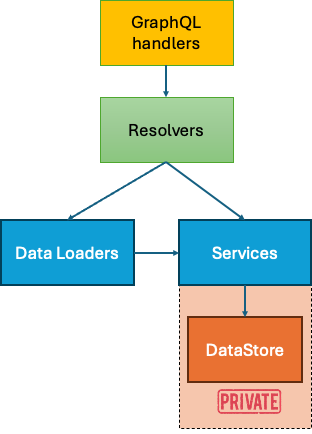

# Content

This demo project demonstrates an example with two sub-graphs and one super-graph.


## Architecture 

The diagram below shows the general architecture of one subgraph. As we can see, resolvers decide when to use a data loader or service. However, only the service can access data, which are in this case considered completely private, following microservices patterns. 



# Architectural dilemma

In this demo implementation, we "abuse" the mono-repo by using the ActorService in the MovieService. Isolating communication on service to service layer (which is done in this demo) is first step to "physically" separate services. 

## Run 

### First run sub-graphs

- Open actors folder in terminal, and run `make run`
- Open movies folder in terminal, and run `make run`

### Run supergraph

For this demo we'll use Apollo Gateway, but for production consider using Apollo Router.

run `npm run start`

### Create some queries:

- Open localhost:4000

In Apollo sandbox, type these queries (pne per window) and try:


```
query Actors {
  actors {
    id
    movies {
      title
      imdbId
      id
    }
    name
    imdbId
    movieImdbIds
  }
}
```

```
query Actor($name: String!) {
  actor(name: "Johnny Depp") {
    name
    movies {
      title
    }
  }
}
```

```
query Movies {
  movies {
    title
  }
}
```
